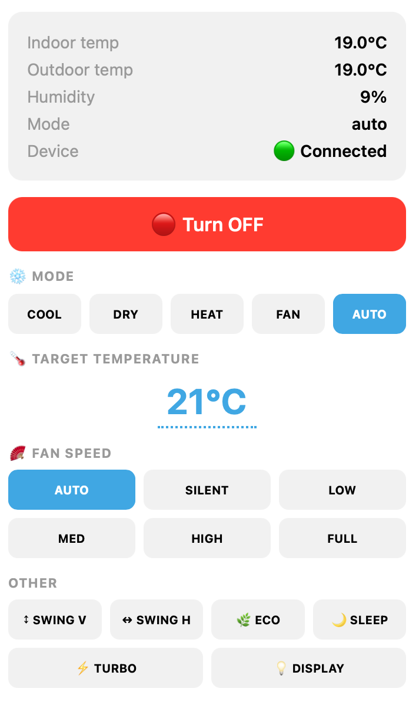

# Golang API for Midea Porta Split AC

A Go library for controlling a Midea Porta Split air conditioner over the local network. No cloud round-trip is needed once you have the device credentials.

The library also ships with a small CLI that covers the common operations: reading state, changing settings, querying capabilities and energy usage.

The protocol implementation is based on the Python libraries `msmart-ng` and `midea_ac_lan`. Note that those two libraries disagree on mode wire values; this library follows `midea_ac_lan`. If modes appear wrong on your unit, check which convention your device expects.

## Scope

This library was written to power a personal chatbot UI for controlling one specific Midea Porta Split V3 unit. The bot itself is not part of this project. The API surface reflects that: it covers the operations that unit needs and nothing more. If your device has features or firmware quirks not present here, you may need to extend it yourself.

<div align="center">
  
</div>

The same context shaped the API design: a single persistent connection with a background heartbeat, sparse pointer-based updates so only the fields you care about need to be specified, and no abstractions beyond what a bot handler actually calls. A general-purpose library would likely make different trade-offs.

👉 If you found the API useful or it solved your problem, feel free to buy me a coffee.

<div align="center">

[](https://www.buymeacoffee.com/thekondor)

</div>

## What you need

Three pieces of information identify your device on the network:

| Item | Where to get it |
|------|----------------|
| IP address | Router DHCP table or UDP discovery |
| Device ID | UDP discovery or Midea cloud API |
| Token + Key | Midea cloud API |

The easiest way to retrieve all three at once is the `msmart-ng` Python tool:

```
pip install msmart-ng
msmart-ng discover
```

Token is 64 bytes (128 hex characters); Key is 32 bytes (64 hex characters).

## Quick start

```go
import (
    "context"
    "encoding/hex"
    "fmt"
    "os"

    midea "github.com/thekondor/midea-porta-split"
)

token, _ := hex.DecodeString(os.Getenv("MIDEA_TOKEN"))
key, _   := hex.DecodeString(os.Getenv("MIDEA_KEY"))

client, err := midea.NewClient("192.168.1.100", token, key, deviceID, midea.DefaultOptions())
if err != nil { /* ... */ }

ctx := context.Background()
if err := client.Connect(ctx); err != nil { /* ... */ }
defer client.Close()

// Read current state.
resp, err := client.Poll(ctx)
fmt.Printf("power=%v mode=%s temp=%.1f\n", resp.Power, resp.Mode, resp.TargetTemp)

// Turn on, set temperature and mode.
on := true
temp := 22.0
resp, err = client.Update(ctx, midea.Request{
    Power:      &on,
    TargetTemp: &temp,
    Mode:       &[]midea.Mode{midea.ModeCool}[0],
})
```

## API

### `NewClient`

```go
func NewClient(addr string, token, key []byte, deviceID uint64, opts Options) (*Client, error)
```

Creates a client. Does not open a connection yet; call `Connect` for that. `addr` may be `"host"` (port 6444 is assumed) or `"host:port"`. `token` must be exactly 64 bytes and `key` exactly 32 bytes; violating either is an error.

### `Connect`

```go
func (c *Client) Connect(ctx context.Context) error
```

Opens the TCP connection, performs the device handshake, and starts a background heartbeat goroutine. Blocks until the handshake completes or the context expires. Cancelling the context while `Connect` is running tears down the partial connection cleanly.

### `Poll`

```go
func (c *Client) Poll(ctx context.Context) (Response, error)
```

Reads and returns the current device state. Safe to call concurrently.

### `Update`

```go
func (c *Client) Update(ctx context.Context, req Request) (Response, error)
```

Applies the settings in `req` and returns the resulting state. Only non-nil pointer fields in `Request` are applied; everything else is left unchanged. If no prior state is cached a `Poll` is performed first, since the device requires a full state snapshot on every set command. The display toggle uses a different wire command than other fields and is handled automatically.

### `Capabilities`

```go
func (c *Client) Capabilities(ctx context.Context) (Capabilities, error)
```

Queries which optional features the device supports (swing angle control, fresh air, breeze modes, humidity control, and so on). Results are merged from two capability queries sent in sequence.

### `Energy`

```go
func (c *Client) Energy(ctx context.Context) (Energy, error)
```

Returns lifetime energy usage, current-run energy, and real-time power draw.

### `SetProperties`

```go
func (c *Client) SetProperties(ctx context.Context, props PropertiesRequest) error
```

Sends advanced property values via the properties command. Only non-nil fields are sent. Does not return updated device state.

### `Close`

```go
func (c *Client) Close() error
```

Stops the heartbeat goroutine and closes the TCP connection. Safe to call more than once.

### `DefaultOptions`

```go
func DefaultOptions() Options
```

Returns a ready-to-use `Options` with the following defaults:

| Field | Default | Meaning |
|-------|---------|---------|
| `DialTimeout` | 10 s | TCP connect timeout |
| `ReadTimeout` | 10 s | Per-read deadline |
| `HeartbeatInterval` | 10 s | Keepalive cadence |
| `PostAuthDelay` | 1 s | Pause after handshake before first command |
| `CmdAttemptTimeout` | 2 s | Per-attempt read wait before resend |
| `CmdMaxAttempts` | 10 | Maximum send attempts per command |

### `SetDebugWriter`

```go
func (c *Client) SetDebugWriter(w io.Writer)
```

Enables raw byte logging to `w`. Pass `nil` to disable.

## Types

**`Request`** - sparse update; set only the fields you want to change. All fields are pointers; nil means no change.

**`PropertiesRequest`** - advanced settings (louver angle, breeze mode, fresh air speed, outdoor silent mode, self-clean). All fields are pointers; nil means no change.

**`Response`** - full device state returned by `Poll` and `Update`.

**`Capabilities`** - feature flags returned by `Capabilities`. The `Raw` map contains all capability IDs and their raw values for cases not covered by named fields.

**`Energy`** - power statistics returned by `Energy`.

**`Mode`** constants: `ModeAuto`, `ModeCool`, `ModeDry`, `ModeHeat`, `ModeFan`.

**`FanSpeed`** constants: `FanSilent`, `FanLow`, `FanMedium`, `FanHigh`, `FanFull`, `FanAuto`.

**`SwingAngle`** constants: `SwingAngleOff`, `SwingAnglePos1` through `SwingAnglePos5` (0, 1, 25, 50, 75, 100).

**`BreezeMode`** constants: `BreezeOff`, `BreezeAway`, `BreezeMild`, `BreezeBreezeless`.

**`FreshAirSpeed`** constants: `FreshAirOff`, `FreshAirLow`, `FreshAirMedium`, `FreshAirHigh`, `FreshAirBoost`.

`TempCelsius` and `TempFahrenheit` are helper functions that convert a Celsius float (as stored in `Response`) to the respective unit.

## CLI

Build the CLI with `go build ./cmd/midea`. Credentials can be passed as flags or environment variables:

```
export MIDEA_TOKEN=<128 hex chars>
export MIDEA_KEY=<64 hex chars>
```

Usage:

```
midea [global flags] <subcommand> [subcommand flags]

Global flags:
  -device HOST[:PORT]   Device IP, port 6444 assumed if omitted (required)
  -token HEX            MIDEA_TOKEN env var as fallback
  -key HEX              MIDEA_KEY env var as fallback
  -device-id UINT       Device ID from discovery (required)
  -debug                Log raw bytes to stderr
  -timeout DURATION     Overall timeout (default 30s)

Subcommands:
  poll                  Read and print current device state
  set [options]         Apply one or more settings, print resulting state
  setprop [options]     Set advanced properties
  capabilities          Print device feature flags
  energy                Print energy usage statistics
```

Set options:

```
  -on / -off
  -temp FLOAT           e.g. 22.5
  -mode STRING          auto|cool|dry|heat|fan
  -fan STRING           auto|silent|low|medium|high|full
  -swing-v / -no-swing-v
  -swing-h / -no-swing-h
  -eco / -no-eco
  -turbo / -no-turbo
  -sleep / -no-sleep
  -display / -no-display
  -frost / -no-frost
  -comfort / -no-comfort
  -fahrenheit / -celsius
  -beep / -no-beep
  -follow-me / -no-follow-me
  -purifier / -no-purifier
  -aux-heat / -no-aux-heat
  -humidity INT         0-100, 0 means not set
```

Setprop options:

```
  -swing-v-angle INT    0 (off), 1, 25, 50, 75, 100
  -swing-h-angle INT    0 (off), 1, 25, 50, 75, 100
  -breeze STRING        off|away|mild|breezeless
  -fresh-air STRING     off|low|medium|high|boost
  -out-silent / -no-out-silent
  -self-clean
```

Examples:

```bash
midea -device 192.168.1.100 -device-id 123456789 poll
midea -device 192.168.1.100 -device-id 123456789 set -on -temp 22.0 -mode cool -fan auto
midea -device 192.168.1.100 -device-id 123456789 setprop -swing-v-angle 50
midea -device 192.168.1.100 -device-id 123456789 capabilities
midea -device 192.168.1.100 -device-id 123456789 energy
```

## Disclaimer

This library is an independent, unofficial implementation based on reverse-engineered protocol documentation and community Python libraries. It is not affiliated with or endorsed by Midea in any way.

Use it at your own risk. Sending commands to an AC unit over an undocumented protocol may cause unexpected behavior, including but not limited to incorrect operation, loss of device settings, or hardware damage. The author take no responsibility for any damage to your device, property, or anything else that may result from using this software.

## Copyright

Copyright (c) 2026 Andrew 'kondor' Sichevoi. MIT License.
